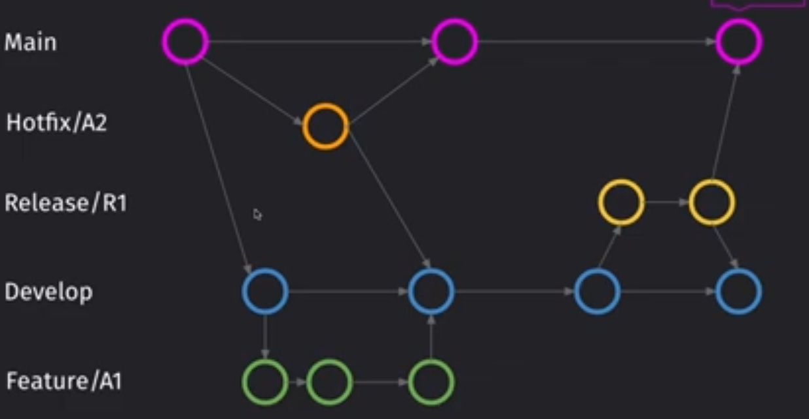

# React + TypeScript + Vite

## 🧭 Git Flow

Git Flow — это стандарт для организации веток в проекте

📦 Основные ветки:

main — стабильный продакшн код

develop — активная разработка

🧩 Вспомогательные ветки:

feature/\* — новые фичи (новый функционал)

fix/\* — исправления багов

hotfix/\* — срочные исправления в продакшне

release/\* — подготовка к релизу

